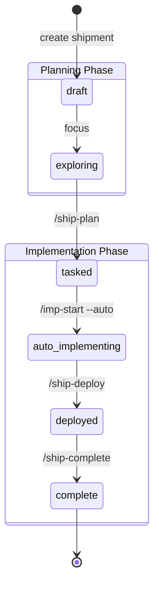

# Shipment Lifecycle

**Status**: Living document
**Last Updated**: 2026-02-09

Shipments move through two phases: **Planning** and **Implementation**.

---

## State Diagram

---

## Planning Phase

| State | Description | Next Step |
|-------|-------------|-----------|
| `draft` | Shipment created | Focus to begin exploration |
| `exploring` | Ideation and research | `/ship-plan` to create tasks |
| `tasked` | Tasks defined | `/imp-start --auto` to begin |

**Skills used**: `/ship-new`, `/orc-ideate`, `/ship-synthesize`, `/ship-plan`

---

## Implementation Phase

| State | Description | Next Step |
|-------|-------------|-----------|
| `auto_implementing` | IMP working autonomously | `/ship-deploy` when done |
| `deployed` | Merged to main branch | `/ship-complete` to finish |
| `complete` | Terminal state | — |

**Skills used**: `/imp-start`, `/imp-plan-create`, `/imp-rec`, `/ship-deploy`, `/ship-complete`

---

## Auto Mode

Auto mode (`auto_implementing`) is the default implementation path:

- Stop hook blocks until shipment completes
- IMP is propelled through the workflow automatically
- Toggle off with `/imp-auto off` if manual control needed

---

## See Also

- [docs/schema.md](schema.md) - Database schema with all valid states
- [internal/core/shipment/guards.go](../internal/core/shipment/guards.go) - Guard implementations
